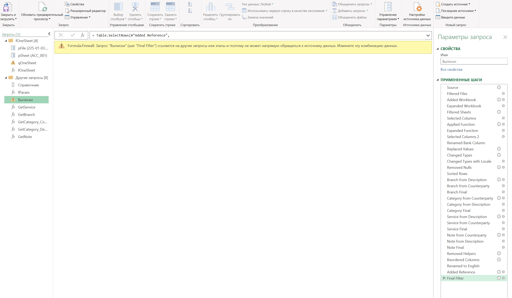
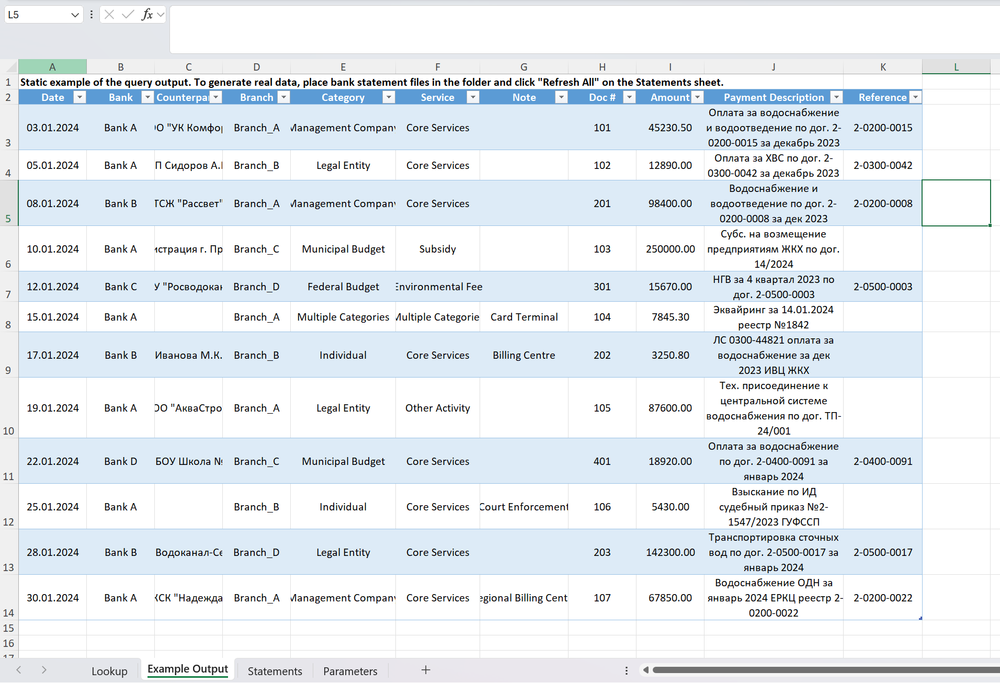

# Bank Statement Automation — Power Query ETL Pipeline
 
Automated processing o f bank statements from multiple banks with different formats. The pipeline normalizes column names, merges data into a single table, and classifies each payment by branch, payer type, service category, and collection channel — fully inside Excel, with no VBA or external scripts.

Built for a utility company processing 100,000+ transactions per month, but the architecture is format-agnostic and adapts to any industry where payments arrive from multiple sources in inconsistent formats.

## The Problem

The company receives monthly bank statements from four banks. Each bank exports data in its own Excel format: different column names for the same fields, different header positions, different number formats. An analyst was spending several hours each month manually copying, renaming, and classifying thousands of rows.

## The Solution

A single Excel workbook with a Power Query pipeline that:

1. **Reads all `.xlsx` files from a folder** automatically — drop new statements into the folder, refresh, done.
2. **Detects the header row dynamically.** Bank statements have a "floating" header — it can appear at row 3, row 5, or row 8 depending on the bank. The query searches for the row containing the date field, marks it, and uses `Table.FillDown` + filter to anchor the data correctly.
3. **Normalizes column names** using a lookup table. Different banks call the same field "Дата проводки", "Дата", or "Кредит" vs "Сумма по кредиту". The lookup table maps all variants to a standard set — adding a new bank requires only a new row in this table, not a code change.
4. **Classifies each payment on four dimensions** using a dual-source cascade pattern (explained below).
5. **Extracts a reference number** from free-text payment descriptions using string manipulation in M.
6. **Outputs a clean, unified table** with a PivotTable and Slicer for interactive analysis.

## Key Technique: Dual-Source Cascade Classification

Each classification dimension (branch, payer category, service type, payment channel) is determined by applying the same classifier function to **two different fields** — first the counterparty name, then the payment description — with a fallback:

```
if ClassifyByField1(counterparty) <> null
    then ClassifyByField1(counterparty)
    else ClassifyByField2(payment_description)
```

This significantly increases classification coverage because different payers fill in different fields consistently. Some always write detailed payment descriptions but leave the counterparty field generic; others do the opposite.

Each classifier is a standalone function (`GetBranch`, `GetCategory`, `GetService`, `GetNote`) that can be tested and maintained independently.

## Architecture

```
Folder (bank statement files)
    │
    ├── BankStatement_16070_2023-12.xlsx    ← Bank A format
    ├── BankStatement_25669_2023-12.xlsx    ← Bank B format
    ├── 225-01-03.03.xlsx                  ← Bank C format
    └── BankStatement_branch_004_2023-12.xlsx  ← Bank D format
    
         ↓  Folder.Files()

   ┌─────────────────────────────────┐
   │  fOneSheet (parameterised)      │  ← processes one sheet from one file
   │  • Detect header row            │
   │  • Normalize column names       │
   │  • Select & clean fields        │
   └─────────────────────────────────┘
   
         ↓  applied to each file × sheet combination

   ┌─────────────────────────────────┐
   │  Main query: Выписки            │
   │  • Merge all files              │
   │  • Classify: Branch             │
   │  • Classify: Payer Category     │
   │  • Classify: Service Type       │
   │  • Classify: Payment Channel    │
   │  • Extract reference number     │
   │  • Output unified table         │
   └─────────────────────────────────┘
```

## Query Reference

|Query|Type|Purpose|
|---|---|---|
|`Выписки`|Main|Orchestrates the full pipeline: reads folder → processes files → classifies → outputs|
|`fOneSheet`|Function|Processes a single sheet: header detection, column normalization, field selection|
|`qOneSheet`|Test|Calls `fOneSheet` with current parameter values for step-by-step debugging|
|`GetBranch`|Classifier|Determines branch by prefix code, city name, or counterparty|
|`GetCategory_Counterparty`|Classifier|Determines payer type from counterparty name (legal form, budget level)|
|`GetCategory_Description`|Classifier|Fallback: determines payer type from payment description|
|`GetService`|Classifier|Determines service category (core, regulatory, non-core, subsidy)|
|`GetNote`|Classifier|Determines payment collection channel (card terminal, post office, court enforcement, etc.)|
|`Справочник`|Lookup|Reads the column name mapping table|
|`fParam`|Helper|Reads configuration parameters (folder path) from the Parameters sheet|
|`pFile` / `pSheet`|Parameter|Dropdown parameters for testing individual files and sheets|

## Output Columns

|Column|Description|
|---|---|
|Date|Transaction date|
|Bank|Source bank (anonymised as Bank A–D)|
|Counterparty|Payer name (original from bank statement)|
|Branch|Company branch the payment belongs to|
|Category|Payer type: Legal Entity, Individual, Management Company, Municipal/Regional/Federal Budget|
|Service|Revenue category: Core Services, Subsidy, Environmental Fee, Other Activity|
|Note|Collection channel: Card Terminal, Post Office, Court Enforcement, Billing Centre, etc.|
|Doc #|Payment document number|
|Amount|Transaction amount|
|Payment Description|Original payment purpose text|
|Reference|Extracted contract/account reference number|

## Result

Processing time reduced from several hours of manual work to 20–30 seconds. The analyst drops new statement files into the folder, clicks "Refresh All", and gets a complete classified table ready for reporting.

## Repository Structure

```
├── en/
│   └── Statements.xlsx        ← English version (translated comments, column headers, categories)
├── ru/
│   └── Выписки.xlsx           ← Russian version (original)
├── screenshots/
│   ├── power_query_editor.png ← Query dependency tree in Power Query
│   ├── output_table.png       ← Final classified output with real (anonymised) data
│   └── pivot_slicer.png       ← PivotTable with interactive slicer
└── README.md
```

## Screenshots

### Power Query Editor — query architecture


### Classified output table


> Each workbook also includes an **Example Output** sheet with static sample data, so you can see the result structure without running the queries.

## How to Use

1. Clone or download this repository.
2. Place your bank statement `.xlsx` files in a folder on your machine.
3. Open the workbook (`Statements.xlsx` or `Выписки.xlsx`).
4. On the **Parameters** sheet, the `Path` cell auto-detects the workbook location. Create a subfolder next to the workbook and place your statement files there, or edit the folder name in the formula.
5. Go to **Data → Refresh All**.
6. The **Statements** sheet will populate with the unified, classified table.

To add a new bank format, add the column name mappings to the **Lookup** sheet — no code changes required.

## Tech Stack

Excel 365 · Power Query (M language) · PivotTable · Slicer

## About Me

I'm Valery, a data automation specialist with 7+ years of experience in financial and operational reporting. I build automated data pipelines that eliminate manual Excel work — if you spend hours every month on the same spreadsheet routine, I can automate it.

Available for freelance projects on [Upwork](https://www.upwork.com/freelancers/~your_profile_link).
